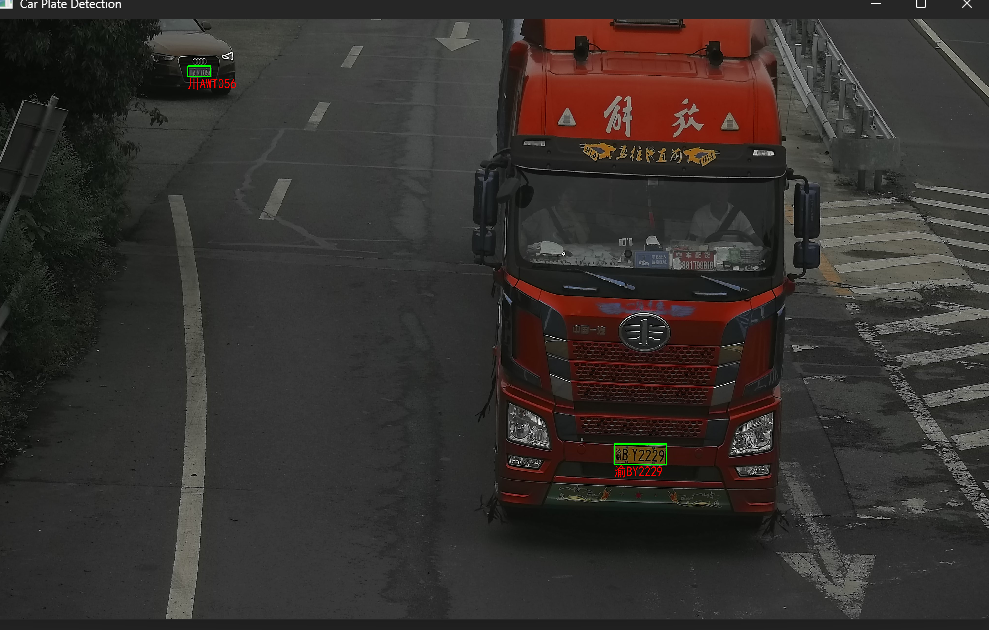
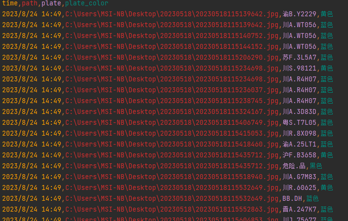

# -*- 车牌识别 -*-
## 项目说明：
用于车牌检测和识别，给定车辆图片，识别车牌和车牌颜色，

2023.8.24

liyunxiao 实习笔记
## 环境说明：

python version >= 3.6

onnx verison >= 1.11

## 准备数据
测试检测数据链接：链接：https://pan.xunlei.com/s/VNcaO1Qv87aZxffZLThnARHkA1#提取码：six2

复制这段内容后打开手机迅雷App，查看更方便 


## 运行
数据准备好后修改config配置文件
修改文件路径为自己下载数据文件夹的路径
```
folder_path = r"C:\Users\MSI-NB\Desktop\20230518"
```
然后终端键入以下命令或者运行调试main.py
```python
python main.py
```


运行结果可以查看日志log.csv

## 模型说明（Mymodel）
车牌识别的模型，为onnx模型
```
plate_rec_color.onnx
```
车牌检测的模型，为onnx模型
```
plate_detect.onnx
```
多功能模型（大致有10种检测模型）可以试着部署模型试一试
```
pd_best1.onnx
```

## 其他
py文件均是源代码文件，可以自行查看

SimHei.ttf为中文语言包，避免cv2画图出现中文乱码

## QQ联系
2024581082